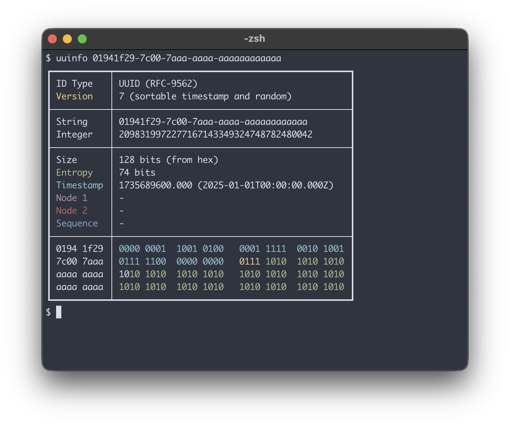

# uuinfo: UUID (+others) Information

A tool to debug unique identifiers (UUID, ULID, Snowflake, etc).

This is a simple CLI program to parse and debug compound unique identifiers, that means, ID’s with built-in structure to achieve uniqueness, like randomness, hashed data, timestamp, node or sequence. It understands most 128 and 64-bit IDs, and some other obscure lengths, including text-only representations.

Just input some ID and **uuinfo** will try to infer as much information as possible from it:



If the ID formats allows for it, **uuinfo** also shows its bits, color-coded by type; the key of the color doubles as the values from the left column in the rendered card. The colors on your system may differ, since those are ANSI colors instead of hardcoded ones.

## Supported ID Formats

- [UUID](https://www.rfc-editor.org/rfc/rfc9562.html): versions 1 to 8, Nil, Max, NCS and Microsoft GUID.
- UUID wrappers: [ShortUUD](https://github.com/skorokithakis/shortuuid), [Base64](https://en.wikipedia.org/wiki/Base64) and [Uuid25](https://github.com/uuid25/python)
- [ULID](https://github.com/ulid/spec)
- [UPID](https://github.com/carderne/upid)
- [MongoDB ObjectId](https://www.mongodb.com/docs/manual/reference/method/ObjectId/)
- [KSUID](https://github.com/segmentio/ksuid)
- [Xid](https://github.com/rs/xid)
- [CUID1](https://github.com/paralleldrive/cuid) / [CUID2](https://github.com/paralleldrive/cuid2)
- [SCRU128](https://github.com/scru128/spec) / [SCRU64](https://github.com/scru64/spec)
- [Timeflake](https://github.com/anthonynsimon/timeflake)
- [Flake](https://github.com/boundary/flake) (Boundary)
- [Nano ID](https://zelark.github.io/nano-id-cc/)
- [TSID](https://github.com/f4b6a3/tsid-creator)
- [Sqids](https://sqids.org/)
- [Hashids](https://github.com/hashids)
- [YouTube Video ID](https://www.youtube.com/watch?v=gocwRvLhDf8)
- [Stripe ID](https://dev.to/stripe/designing-apis-for-humans-object-ids-3o5a)
- [Datadog Trace ID](https://docs.datadoghq.com/tracing/guide/span_and_trace_id_format/)
- [NUID](https://github.com/nats-io/nuid) (NATS)
- [TypeID](https://github.com/jetify-com/typeid) (Jetify)
- 128-bit formats encoded as UUID: ULID, UPID, Flake, Timeflake and SCRU128
- Snowflake variants:
  - [Twitter](https://developer.x.com/en/docs/x-ids)
  - [Discord](https://discord.com/developers/docs/reference#snowflakes)
  - [Instagram](https://instagram-engineering.com/sharding-ids-at-instagram-1cf5a71e5a5c)
  - [Sony](https://github.com/sony/sonyflake)
  - [Spaceflake](https://github.com/kkrypt0nn/spaceflake)
  - [Mastodon](https://github.com/mastodon/mastodon/blob/main/lib/mastodon/snowflake.rb)
  - LinkedIn
  - [Frostflake](https://github.com/ordo-one/package-frostflake)
- [Unix timestamp](https://en.wikipedia.org/wiki/Unix_time) (seconds, ms, μs and ns)
- [Hex-encoded Hash](https://en.wikipedia.org/wiki/Secure_Hash_Algorithms)
- [IPFS CID](https://docs.ipfs.tech/concepts/content-addressing/) (v0 and v1)

## Installation

**Uuinfo** was developed in [Rust](https://www.rust-lang.org), thus it requires [its toolchain](https://www.rust-lang.org/tools/install); if you already have it available, you can install it with `cargo`:

```
$ cargo install uuinfo
```

### Via Docker

```
$ docker run racum/uuinfo {ID}
...
```

## Usage

For a complete list of options, just run the help: `uuinfo --help`.

### Auto Detect

If you just input an ID without any options, **uuinfo** will try to detect its format using very basic heuristics on its length and popularity; and this may work for most cases.

```
$ uuinfo 01941f29-7c00-7aaa-aaaa-aaaaaaaaaaaa
...
```

### Parse Everything

If you are not sure about the ID format, you can see the cards for all formats that it got parsed successfully with `-e`/`—everything`; and with that, you can see what result makes more sense.

**Note**: this argument disables the output options.

### Force Format

Sometimes an ID could be valid for more than one format, if this happens and the auto-detection above picks the wrong one, you can disambiguate using the `-f` (of `--force`) parameter.

For example, the ID `12345678901234567890` is automatically detected as a **Snowflake**, but, it could also be a valid **Xid**. If you want to force **uuinfo** to parse it as Xid, call it like this:

```
$ uuinfo -f xid 12345678901234567890
...
```

Check the `--help` for a complete list of values of `-f`/`--force`.

#### Snowflake Variants

Snowflake is **not** an “ID format”, but rather a **category** of formats; since it is just a number, **uuinfo** can’t detect what variation was used to generate it, thus, specifying the variant with `-f`/`—force` is required to be able to get anything useful from it.

Fortunately, **uuinfo** can compare Snowflakes and sort them by date; for example:

```
$ date
Sat Dec 28 12:47:07 -03 2024

$ uuinfo --compare-snowflake 1777150623882019211
Date/times of the Snowflake ID if parsed as:
- 1983-02-11T01:32:03.000Z Frostflake
- 1983-06-06T00:02:06.595Z LinkedIn
- 2018-05-11T21:08:05.018Z Instagram
- 2024-04-08T01:45:01.252Z Twitter
- 2024-12-28T15:47:08.000Z --- Now ---
- 2026-04-25T20:57:03.000Z Unix timestamp (nanoseconds)
- 2028-06-05T00:02:06.595Z Discord
- 2028-06-05T00:02:06.595Z Spaceflake
- 2033-06-05T00:02:06.595Z TSID
- 2048-03-26T00:05:16.480Z Sony
- 2829-04-23T02:15:02.106Z Mastodon
```

Notice that **TSID**, although not a Snowflake variant, it is similar enough (64-bit with timestamp) to be compared together.

In this case, the ID `1777150623882019211` is probably from Twitter, since it is the most recent value from the list that is not in the future.

Once identified the variant, just run it again enforcing its type:

```
$ uuinfo -f sf-twitter 1777150623882019211
...
```

### Pipe from STDIN

Use a dash (`-`) instead of the ID to get the value from STDIN piped from another program:

```
$ echo 8ff95663-c8ee-48b9-a236-a2f29a991001 | uuinfo -
...
```

### Output Options

#### Card (default)

This is the pretty-printed output, with all the extracted data, plus a hexadecimal and binary representation of the bits at the end:

```
$ uuinfo 01941f29-7c00-7aaa-aaaa-aaaaaaaaaaaa
┏━━━━━━━━━━━┯━━━━━━━━━━━━━━━━━━━━━━━━━━━━━━━━━━━━━━━━━━━━━┓
┃ ID Type   │ UUID (RFC-9562)                             ┃
┃ Version   │ 7 (sortable timestamp and random)           ┃
┠───────────┼─────────────────────────────────────────────┨
┃ String    │ 01941f29-7c00-7aaa-aaaa-aaaaaaaaaaaa        ┃
┃ Integer   │ 2098319972277167143349324748782480042       ┃
┃ ShortUUID │ 2J2YViS7khb9taUUPULmrj                      ┃
┃ Base64    │ KR-UAQB8qnqqqqqqqqqqqg==                    ┃
┠───────────┼─────────────────────────────────────────────┨
┃ Size      │ 128 bits                                    ┃
┃ Entropy   │ 74 bits                                     ┃
┃ Timestamp │ 1735689600.000 (2025-01-01T00:00:00.000Z)   ┃
┃ Node 1    │ -                                           ┃
┃ Node 2    │ -                                           ┃
┃ Sequence  │ -                                           ┃
┠───────────┼─────────────────────────────────────────────┨
┃ 0194 1f29 │ 0000 0001  1001 0100   0001 1111  0010 1001 ┃
┃ 7c00 7aaa │ 0111 1100  0000 0000   0111 1010  1010 1010 ┃
┃ aaaa aaaa │ 1010 1010  1010 1010   1010 1010  1010 1010 ┃
┃ aaaa aaaa │ 1010 1010  1010 1010   1010 1010  1010 1010 ┃
┗━━━━━━━━━━━┷━━━━━━━━━━━━━━━━━━━━━━━━━━━━━━━━━━━━━━━━━━━━━┛
```

#### Short

This is just the 2 first lines of the card in one, with the ID type and version:

```
$ uuinfo -o short 01941f29-7c00-7aaa-aaaa-aaaaaaaaaaaa
ID Type: UUID (RFC-9562), version: 7 (sortable timestamp and random).
```

#### JSON

In case you need to integrate **uuinfo** with some other commands, there is a JSON output available:

```
$ uuinfo -o json 01941f29-7c00-7aaa-aaaa-aaaaaaaaaaaa | jq
{
  "id_type": "UUID (RFC-9562)",
  "version": "7 (sortable timestamp and random)",
  "standard": "01941f29-7c00-7aaa-aaaa-aaaaaaaaaaaa",
  "integer": 2098319972277167143349324748782480042,
  "short_uuid": "2J2YViS7khb9taUUPULmrj",
  "base64": "KR-UAQB8qnqqqqqqqqqqqg==",
  "uuid_wrap": null,
  "size": 128,
  "entropy": 74,
  "datetime": "2025-01-01T00:00:00.000Z",
  "timestamp": "1735689600.000",
  "sequence": null,
  "node1": null,
  "node2": null,
  "hex": "01941f297c007aaaaaaaaaaaaaaaaaaa"
}
```

#### Binary

You can also return just the raw binary representation of the ID, but, be careful, this can mess up your terminal:

```
$ uuinfo -o binary 01941f29-7c00-7aaa-aaaa-aaaaaaaaaaaa
�)|z���������%
```

I recommend to pipe into a command that can handle binary, like `xxd`:

```
$ uuinfo -o binary 01941f29-7c00-7aaa-aaaa-aaaaaaaaaaaa | xxd
00000000: 0194 1f29 7c00 7aaa aaaa aaaa aaaa aaaa  ...)|.z.........
```

You can even see the same bits from the card with `xxd -b`:

```
$ uuinfo -o binary 01941f29-7c00-7aaa-aaaa-aaaaaaaaaaaa | xxd -b
00000000: 00000001 10010100 00011111 00101001 01111100 00000000  ...)|.
00000006: 01111010 10101010 10101010 10101010 10101010 10101010  z.....
0000000c: 10101010 10101010 10101010 10101010                    ....
```

## Contributing

### New ID Format Support


Hunting for ID formats is a rabbit-hole! I published the first version of **uuinfo** with the formats I found on my research. If you want to add more formats, please create a [GitHub issue](https://github.com/racum/uuinfo/issues) containing the following:

- Reference link
- Size in bits and the map of bits
- ID examples (more than one if possible) with its encoded data (timestamp, node, sequence, etc)
- Alphabet (if applicable)
- Epoch (if custom)
- Source-code (if available)

The more information I get, the easier will be for me to implement it!

### Code Contribution

Just create a PR, but try to follow some basic guidelines:

- Look at the current structure and try to emulate it.
- One format per file, unless they are related.
- Run `cargo fmt` and `Cargo clippy` before committing.


## License

**Uuinfo** is under the 3-Clause BSD License.
